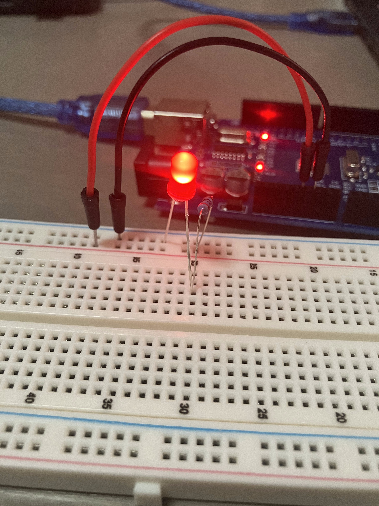
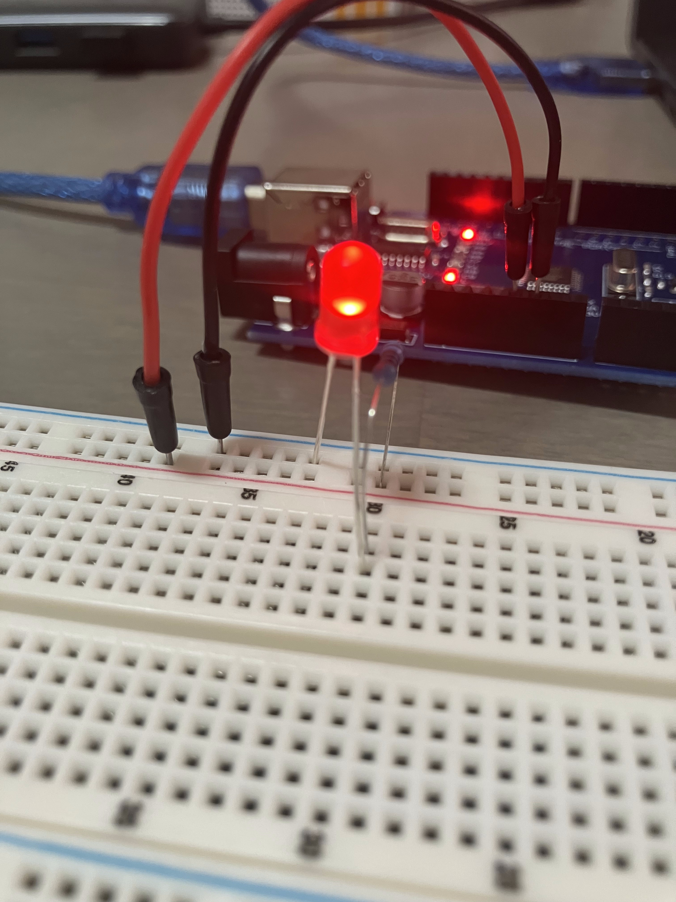
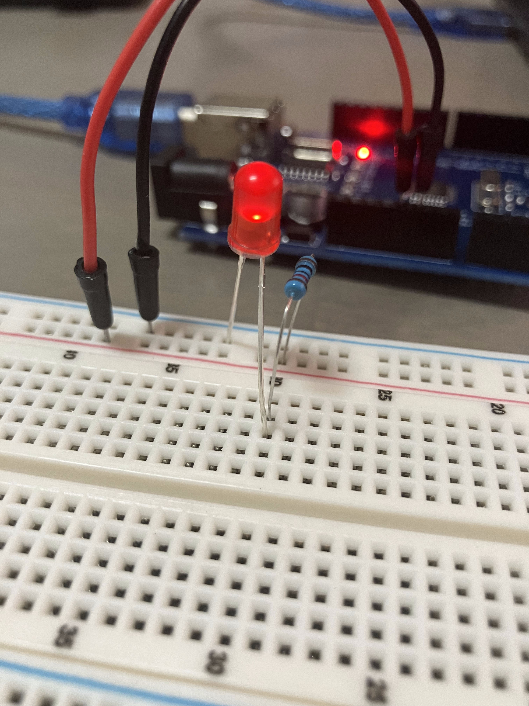

# Lesson 3 – LED

## 📘 Overview
In this lesson, I learned how to change the brightness of an LED by using different values of resistor(220 ohm, 1k ohm and 10k ohm).

## 🔧 Components Used
- Arduino Uno R3 Board × 1
- 5mm red LED × 1
- 220 ohm resistor × 1
- 1k ohm resistor × 1
- 10k ohm resistor × 1
- M-M wires × 2

## 🖼️ Circuit Setup
Here’s a photo of the actual circuit wired on the breadboard:

<table>
  <tr>
    <th>220 ohm</th>
    <th>1k ohm</th>
    <th>10k ohm</th>
  </tr>
  <tr>
    <td align="center">
      
    </td>
    <td align="center">
      
    </td>
    <td align="center">
      
    </td>
  </tr>
</table>

## 📝 Notes
### ✅ What I Learned
- How to make a circuit with a breadboard.

---
