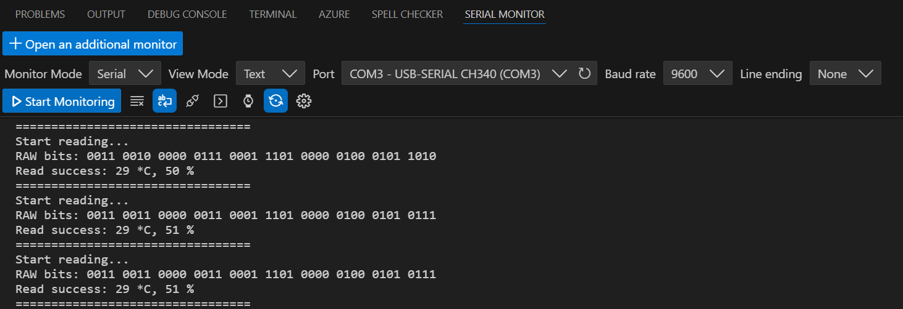

# Lesson 9 – DHT11 Temperature and Humidity Sensor

## 📘 Overview
In this lesson, I learned how to use a DHT11 Temperature and Humidity Sensor and how to monitor measured values.

## 🔧 Components Used
- Arduino Uno R3 Board × 1
- F-M wires × 3
- DHT11 Temperature and Humidity module × 1

## 🖼️ Circuit Setup and Serial Monitor
Here’s a photo of the actual circuit wired on the breadboard and the serial monitor:

## 📝 Notes
### ✅ What I Learned
- How to use a DHT11 temperature and humidity sensor.
- How to import libraries by Library Manager.
- How to use Serial Monitor.

---
