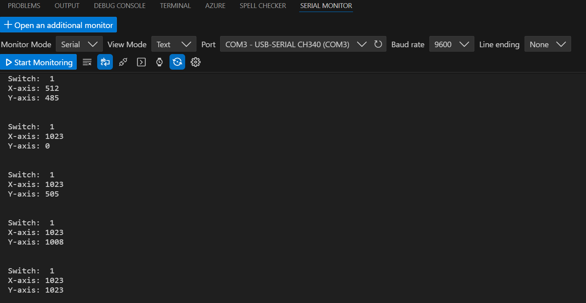

# Lesson 12 – Analog Joystick Module

## 📘 Overview
In this lesson, I learned how to use an analog joystick.

## 🔧 Components Used
- Arduino Uno R3 Board × 1
- F-M wires × 5
- Joystick module × 1

## 🖼️ Circuit Setup and Serial Monitor
Here’s a photo of the actual circuit wired on the breadboard and the serial monitor:

## 📝 Notes
### ✅ What I Learned
- How to use an analog joystick and monitor its value.

---
