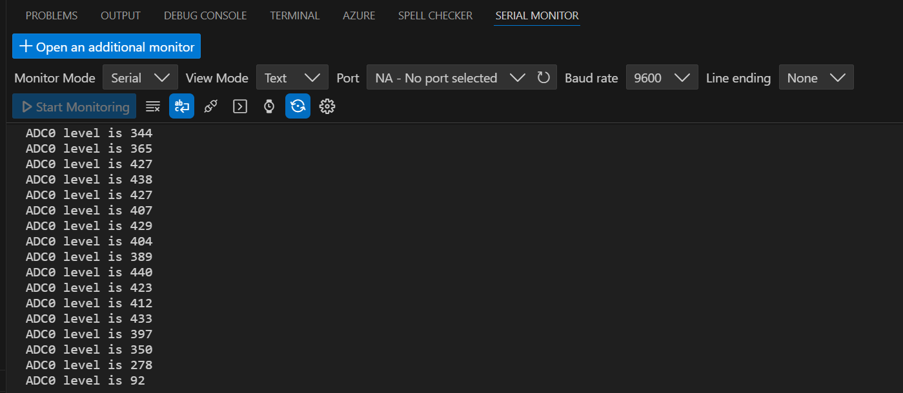

# Lesson 13 – Water Level Detection Sensor Module

## 📘 Overview
In this lesson, I learned how to use a water level detection sensor.

## 🔧 Components Used
- Arduino Uno R3 Board × 1
- F-M wires × 3
- Water lever detection sensor module × 1

## 🖼️ Circuit Setup and Serial Monitor
Here’s a photo of the actual circuit wired on the breadboard and the serial monitor:

## 📝 Notes
### ✅ What I Learned
- How to use a water level detection sensor.

---
