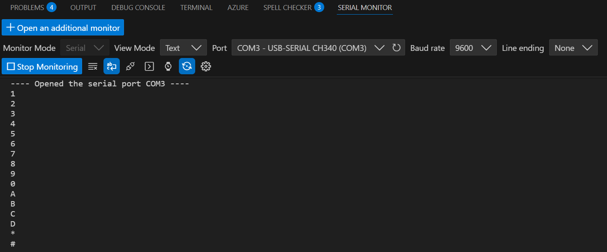

# Lesson 16 – Membrane Switch Module

## 📘 Overview
In this lesson, I learned how to integrate a keyboard.

## 🔧 Components Used
- Arduino Uno R3 Board × 1
- M-M wires × 8
- Membrane switch module × 1

## 🖼️ Circuit Setup and Serial Monitor
Here’s a photo of the actual circuit wired on the breadboard and the serial monitor:

## 📝 Notes
### ✅ What I Learned
- How to use a keyboard.

---
